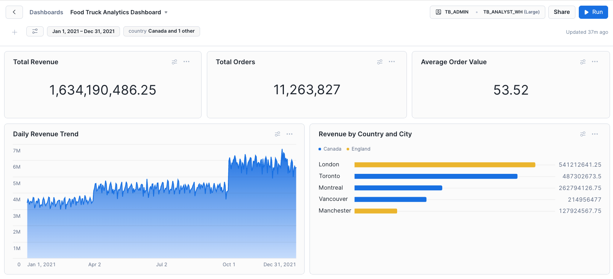

# Building a Snowflake Dashboard for Food Truck Analytics

## Introduction

Welcome to this tutorial on building a Snowflake dashboard! In this guide, you'll learn how to create an interactive business intelligence dashboard using Snowflake's built-in visualization tools. We'll be working with a food truck business dataset that includes customer loyalty metrics, order details, and customer reviews.

**What you'll build:** A complete analytics dashboard showing:
- Sales performance across different countries and cities for a selected time periods

## Building Your Dashboard

We'll follow the [official Snowflake dashboard documentation](https://docs.snowflake.com/en/user-guide/ui-snowsight-dashboards) to build our analytics dashboard.

### Step 1: Create Your Dashboard and First Tile

1. First, ensure you are using the correct role by clicking on your username in the top right corner and selecting **"Switch Role"**, then choose **"TB_ADMIN"**
2. In your Snowflake web interface, navigate to **Projects » Dashboards**
3. Click **"+ Dashboard"** to create a new dashboard
4. Give your dashboard a name: **"Food Truck Analytics Dashboard"**
5. Select a warehouse for the dashboard: choose **"TB_ANALYST_WH"** from the warehouse dropdown

Now let's create our first dashboard tile:

6. Click **"+"** (Add a dashboard tile)
7. Select **"New Tile from Worksheet"** - this opens a blank worksheet overlaying the dashboard
8. Select the database and schema from the dropdown: choose **"TB_101.ANALYTICS"**
9. In the SQL editor, paste our Daily Sales Trends query:

```sql
SELECT 
    DATE,
    COUNT(DISTINCT ORDER_ID) as TOTAL_ORDERS,
    SUM(ORDER_TOTAL) as DAILY_REVENUE,
    AVG(ORDER_TOTAL) as AVERAGE_ORDER_VALUE,
    COUNT(DISTINCT CUSTOMER_ID) as UNIQUE_CUSTOMERS
FROM ORDERS_V
GROUP BY DATE
ORDER BY DATE;
```

10. Run the SQL query to confirm it works and returns data
11. Click **"Chart"** to configure chart details
12. **Configure the Chart:**
    - Chart Type: **Line Chart**
    - X-Axis: **DATE**
    - Y-Axis: **DAILY_REVENUE**
    - Title: **"Daily Revenue Trend"**

13. Click **"Return to Food Truck Analytics Dashboard"** to save your worksheet and add it to the dashboard

**💡 Dashboard Tip:** Following Snowflake's documentation, tiles are flexible collections of charts that visualize your query results and can be customized and rearranged.

### Step 2: Explore Dashboard Filters and Create Custom Filter

Now let's explore the built-in filtering capabilities and add a custom filter:

1. In your dashboard, click **"Show or hide filter"** to reveal the filter panel
2. **Observe the system filters** that are automatically available:
   - **Date Range filter** (`:daterange`) - allows filtering by date periods
   - **Date Bucket filter** - allows grouping dates by day, week, month, etc.

3. **Create a custom Country filter:**
   - Click **"+ Filter"** to add a new custom filter
   - **Display Name:** `country`
   - **SQL Keyword:** `country`
   - **Warehouse:** Select **"DEFAULT_WH"** from the warehouse prompt
   - **Options via:** Select **"Query"** and click **"Write Query"**
   - In the **New filter window**, create this query:
   ```sql
   SELECT DISTINCT COUNTRY 
   FROM TB_101.RAW_POS.TRUCK 
   ORDER BY COUNTRY;
   ```
   - Run the SQL query to confirm it returns a list of countries
   - Click **"Done"**
   - Back on the add filter screen, change **Refresh** to **"Refresh daily"**
   - Select the options for **"Multiple values can be selected"** and **"Include an 'All' option"**
   - Click **"Save"**

**💡 Filter Tip:** Custom filters in Snowflake dashboards use parameter syntax (`:filtername`) and can be referenced in any query on the dashboard.

### Step 3: Edit Daily Sales Trend with Date Filter

Now let's modify our existing tile to use the date range filter:

1. From your Daily Revenue Trend tile, click the **tile menu (More options)** and select **"Edit query"**
2. **Update the query** to include date and country filters:

```sql
SELECT 
    DATE,
    COUNT(DISTINCT ORDER_ID) as TOTAL_ORDERS,
    SUM(ORDER_TOTAL) as DAILY_REVENUE,
    AVG(ORDER_TOTAL) as AVERAGE_ORDER_VALUE,
    COUNT(DISTINCT CUSTOMER_ID) as UNIQUE_CUSTOMERS
FROM ORDERS_V
WHERE DATE = :daterange AND COUNTRY = :country
GROUP BY DATE
ORDER BY DATE;
```

3. Run the query to test it works with the filter
4. **Notice no results were returned.** The default daterange filter is set for **"Last day"**. Click the filter in the top left (it will indicate "Last day") and change to **"Custom"**. Set a date range of **Jan 1, 2021** to **Dec 31, 2021**. Click **"Done"** and click **"Apply"**
5. Click **"Return to Food Truck Analytics Dashboard"** to save your changes

### Step 4: Add Country Performance Analysis Tile

1. Click **"+"** to add another dashboard tile
2. Select **"New Tile from Worksheet"**
3. Select **"TB_101.ANALYTICS"** database and schema
4. **Enter the Country Performance query with both filters:**

```sql
SELECT 
    COUNTRY,
    PRIMARY_CITY,
    COUNT(DISTINCT ORDER_ID) as TOTAL_ORDERS,
    SUM(ORDER_TOTAL) as TOTAL_REVENUE,
    AVG(ORDER_TOTAL) as AVG_ORDER_VALUE,
    COUNT(DISTINCT CUSTOMER_ID) as UNIQUE_CUSTOMERS
FROM ORDERS_V
WHERE DATE = :daterange 
  AND COUNTRY = :country
GROUP BY COUNTRY, PRIMARY_CITY
ORDER BY TOTAL_REVENUE DESC;
```

5. Run the query to confirm it works
6. Click **"Chart"** and configure:
   - Chart Type: **Bar Chart**
   - In the **Data** box, change **TOTAL_ORDERS** to **TOTAL_REVENUE**
   - Change the **Y-Axis** to **PRIMARY_CITY**
   - Click **+ Add column** to select **COUNTRY** column as a **Series** value
   - Change the Grouping Appearance to **Stacked** to improve the visualization
   - Set the **Title** of the chart to **"Revenue by Country and City"**

**💡 Display Tip:** Click the country filter and select 2 or 3 different couuntries to limit the number of rows displayed. 

7. Click **Save** and then click **"Return to Food Truck Analytics Dashboard"**

### Step 5: Create Total Revenue KPI Tile

1. Click **"+"** to add a new dashboard tile
2. Select **"New Tile from Worksheet"**
3. Select **"TB_101.ANALYTICS"** database and schema
4. **Enter the Total Revenue KPI query:**

```sql
SELECT SUM(ORDER_TOTAL) as TOTAL_REVENUE
FROM ORDERS_V
WHERE DATE = :daterange 
  AND COUNTRY = :country;
```

5. Run the query to test
6. Set the **Title:** to "Total Revenue"
7. Click **"Return to Food Truck Analytics Dashboard"**

### Step 6: Duplicate and Modify KPI Tiles

1. **Duplicate the Total Revenue tile:**
   - From the Total Revenue tile menu (More options), select **"Duplicate Tile"**
   - A copy appears at the bottom of the dashboard

2. **Create Total Orders KPI:**
   - From the duplicated tile menu, select **"Edit query"**
   - **Update the query:**
   ```sql
   SELECT COUNT(DISTINCT ORDER_ID) as TOTAL_ORDERS
   FROM ORDERS_V
   WHERE DATE = :daterange 
     AND COUNTRY = :country;
   ```
   - Update title to **"Total Orders"**
   - Click **"Return to Food Truck Analytics Dashboard"**

3. **Duplicate again for Average Order Value:**
   - Duplicate the Total Revenue tile again
   - Edit the query:
   ```sql
   SELECT ROUND(AVG(ORDER_TOTAL), 2) as AVERAGE_ORDER_VALUE
   FROM ORDERS_V
   WHERE DATE = :daterange 
     AND COUNTRY = :country;
   ```
   - Update title to **"Average Order Value"**
   - Format as Currency
   - Click **"Return to Food Truck Analytics Dashboard"**

### Step 7: Reposition KPI Tiles at Top of Dashboard

1. **Drag the KPI tiles to the top:**
   - Click and drag the **Total Revenue** tile to the top-left position
   - Drag the **Total Orders** tile next to it (top-center)
   - Drag the **Average Order Value** tile to the top-right
   - As you drag each tile, you'll see a preview of the new position

2. **Arrange the remaining tiles:**
   - Position the **Daily Revenue Trend** chart below the KPIs
   - Position the **Country Performance** chart at the bottom

**💡 Layout Tip:** Following Snowflake's documentation, you can rearrange tiles by dragging them to new positions, and a preview shows where the tile will be placed.

### Completed Dashboard Example

Here's what your completed dashboard should look like:



The dashboard shows:
- **Top Row:** Three KPI tiles (Total Revenue, Total Orders, Average Order Value)
- **Middle:** Daily Revenue Trend line chart filtered by date and country
- **Bottom:** Revenue by Country and City bar chart with stacked grouping
- **Filters:** Date range and country filters in the top panel for interactive analysis

### Remember

Building great dashboards is an iterative process. Start simple, gather feedback from users, and continuously improve. The most important thing is that your dashboard helps people make better business decisions.
